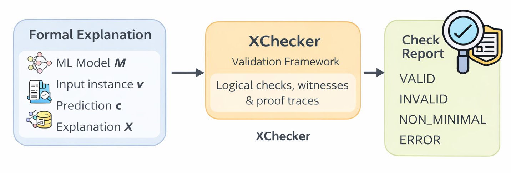

# XChecker

**XChecker** is a Python-based validation framework for formal explainers (AXp/CXp), as described in the paper "Uncovering Bugs in Formal Explainers" [CoRR'25](https://arxiv.org/abs/2511.03169).

It validates formal explanations by checking witnesses, proofs, and model behavior, without trusting any single explainer.

<!--
## Validation Framework for Formal Explainers

Formal *XAI* provides rigorous, model-based guarantees for explanations of ML predictions. However, practical implementations of formal explainers may contain bugs that undermine these guarantees.
The validation framework implemented in XChecker provides a methodoly for validating the explanations 
computed by formal explainers.
The framework is based on comparing the outcomes of different formal explainers, but making no assumptions about the correctness of any of those explainers.
-->

<p align="center">
  
  <br>
  <em>High-level workflow of XCheck</em>
</p>

## Validation Pipeline

The framework assumes the following roles:
- an ML model M
- an untrusted target explainer T
- a reference explainer R
- an independent explainer S (optional)

The validation approach then:
- Validates explanations from an untrusted explainer T (e.g., PyXAI) using a reference explainer R (e.g., RFxpl)
- Validates explainer R's results using proof traces and an independent explainer S (e.g., XReason)
- Checks witnesses against the ML model M

## Architecture

### Core Components

1. **Explainer interfaces** (`checker/explainer.py`): Abstract base classes defining required queries for:
   - `TargetExplainer`: Untrusted explainer (findaxp, findcxp, witness)
   - `ReferenceExplainer`: Reference explainer (iswaxp, iswcxp, prooftrace)
   - `SecondaryExplainer`: Second explainer (iswaxp, iswcxp)
   - `MLModel`: ML model interface (predict)

2. **Checker** (`checker/validator.py`): Main validation class implementing the validation logic from the paper

3. **Concrete Implementations** (`adapters/`):
   - `RFxplExplainerR`: RFxpl as explainer R
   - `XReasonExplainerS`: XReason as explainer S
   - `PyXAIExplainerT`: Template for PyXAI as explainer T

## Usage

### Basic Example

```python
from XChecker.checker import Validator
from XChecker.adapters import RFxplExplainerR, XReasonExplainerS, PyXAIExplainerT
from XChecker.adapters.rfxpl_R import RF_Model

# 1. Load ML model
rf_md = RFSklearn(from_file='model.pkl')
ml_model = RF_Model(rf_md)

# 2. Initialize explainers
explainer_r = RFxplExplainerR(rf_md, feature_names, target_names)
explainer_s = XReasonExplainerS(
    model=ml_model,
    feature_names=feature_names,
    target_names=target_names,
    options=xgb_options
)
explainer_t = PyXAIExplainerT(pyxai_model, domains)

# 3. Create validator
validator = Validator(
    explainer_t=explainer_t,
    explainer_r=explainer_r,
    explainer_s=explainer_s,
    ml_model=ml_model
)

# 4. Validate an explanation
instance = np.array([...])  # Feature vector
prediction = ml_model.predict(instance)
expl = {0, 1, 2}  # Set of feature indices

report = validator.validate_axp((instance, prediction), expl)
print(report)
```

Note: The validator expects the instance as a tuple `(np.ndarray, prediction)`.

### Validation Report

The `ValidationReport` contains:
- `result`: ValidationResult (CORRECT, INCORRECT, NON_MINIMAL, ERROR)
- `is_valid`: Whether explanation is valid
- `is_minimal`: Whether explanation is minimal
- `real_explanation`: Actual minimal explanation found
- `witness`: Witness point if found
- `proof_verified`: Whether proof was verified
- `errors`: List of error messages
- `num_witness_checks`: Number of witness validations
- `num_proof_checks`: Number of proof verifications

## Validation Logic

### AXp Validation

An AXp X is valid if:
1. X is a WAXp (weak abductive explanation)
2. For any t in X, X\\{t} is not a WAXp (minimality)

The validator:
- Uses explainer R to check if X is a WAXp
- If not WAXp: validates witness against ML model
- If WAXp: validates proof trace and checks with explainer S
- Checks minimality by testing each feature removal

### CXp Validation

A CXp Y is valid if:
1. Y is a WCXp (weak contrastive explanation)
2. For any t in Y, Y\\{t} is not a WCXp (minimality)

Similar validation process as AXp but for contrastive explanations.

## Implementation Notes

### RFxpl (Explainer R)

The `RFxplExplainerR` wrapper:
- Uses RFxpl's SAT-based encoding
- Provides proof traces using DRAT format
- Generates witnesses for non-WAXp cases

### XReason (Explainer S)

The `XReasonExplainerS` wrapper:
- Uses XReason's SMT-based encoding
- Provides independent validation of WAXp/WCXp conditions
- Uses Z3 or other SMT solvers

### PyXAI (Explainer T)

The `PyXAIExplainerT` is a template that users must adapt based on their PyXAI installation and API version.

## Extending the Framework

To add support for other explainers:

1. Implement the appropriate interface (`TargetExplainer`, `ReferenceExplainer`, or `SecondaryExplainer`)
2. Implement all required methods
3. Use the validator as shown in examples

## References

Paper: "Uncovering Bugs in Formal Explainer Tools: A Case Study with PyXAI" (https://arxiv.org/abs/2511.03169)
